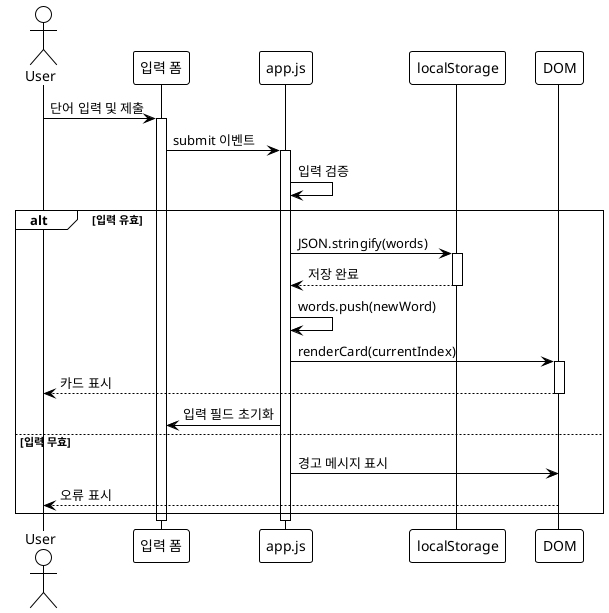

local file link [[h2]]  
external url link -  [Perplexity](https://www.perplexity.ai)

==Table==

| obsidian   | githut | cloudflare |     |
| ---------- | ------ | ---------- | --- |
| git plugin | action | pages      |     |
|            |        |            |     |
![[Pasted image 20260205171925.png]]


```python
    frontmatter = {
        "title": f'"{file_path.stem}" ',
        "date": datetime.datetime.fromtimestamp(file_path.stat().st_mtime).isoformat(),
        "draft": "false",
    }
    
    # 기존 frontmatter 추출 및 업데이트
    fm_match = re.search(r'^---\s*\n(.*?)\n---\s*\n', content, re.DOTALL)
    if fm_match:
        existing_fm_str = fm_match.group(1)
        # 간단한 key: value 파싱
        for line in existing_fm_str.split('\n'):
            if ':' in line:
                key, *value = line.split(':', 1)
                key = key.strip()
                val = value[0].strip()
                if key and val:
                    frontmatter[key] = val
        # 기존 frontmatter를 내용에서 제거
        content = content[fm_match.end():]
```


